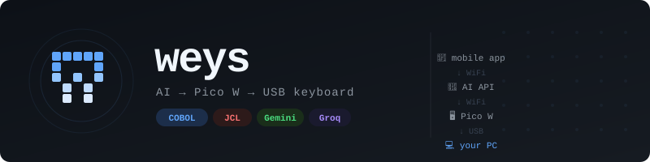
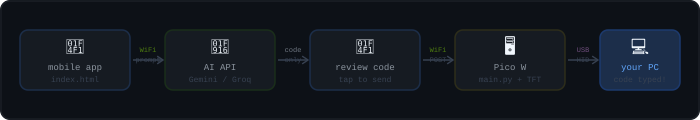
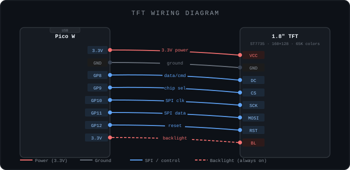
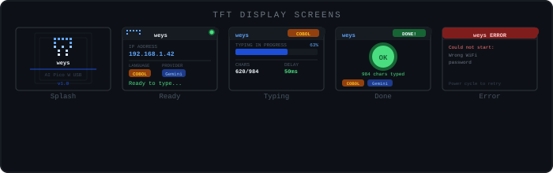

# weys

<p align="center">
  
</p>

<p align="center">
  
</p>

A hardware + software project that lets you describe code on your phone, generate it with an AI API, and have it automatically typed on your PC via a Raspberry Pi Pico W acting as a USB keyboard — no copy-pasting, no switching windows manually.

Primary use case: **COBOL and JCL** code generation, with support for Java, Python, C++, JavaScript, Kotlin, Go, TypeScript, and Rust.

---

## How It Works

<p align="center">
  
</p>

1. Open settings in the mobile app — pick language and AI provider
2. Type a prompt: *"write a COBOL program to add two numbers"*
3. Tap **Generate** — the AI returns only raw code, no explanation
4. Click into your editor on the PC
5. Tap **Type it on PC** — the Pico W types every character via USB
6. Watch the TFT display show a live progress bar as it types

---

## Hardware Requirements

| Part | Notes |
|------|-------|
| Raspberry Pi Pico W | Must be the **W** model (WiFi built in). Pico 2 W also works. |
| 1.8" TFT display (ST7735) | 160×128 px, 65K colours, SPI interface — search "1602 ST7735 SPI" (~$6) |
| USB cable | Micro-USB, connects Pico W to your PC |
| Phone | Any browser — iOS or Android |
| PC | Any OS — the Pico W appears as a standard USB keyboard |

> **Optional:** The display can be skipped if you don't need the visual feedback. The project works without it — just remove the TFT imports and screen calls from `main.py`.

---

## Software Requirements

### On the Pico W

- **CircuitPython** firmware
  - Download: https://circuitpython.org/board/raspberry_pi_pico_w/
- **adafruit_hid** library
  - Download: https://github.com/adafruit/Adafruit_CircuitPython_HID
  - Copy the `adafruit_hid` folder into `/lib` on the Pico W
- **ST7735.py** — TFT display driver
  - Source: https://github.com/AnthonyKNorman/MicroPython_ST7735
  - Copy `ST7735.py` to root of Pico W
- **sysfont.py** — bitmap font for the display
  - From the same repo as ST7735.py
  - Copy `sysfont.py` to root of Pico W

### On your phone

- Any modern mobile browser (Chrome, Safari, Firefox)
- An API key from at least one AI provider (see AI Providers section)

### No installation needed

The mobile app is split into three files — open `index.html` directly in your phone browser or serve from any static file host.

---

## Project Files

```
weys/
├── index.html      — Mobile web app HTML structure
├── styles.css      — All CSS styles and animations
├── app.js          — All JavaScript logic
├── main.py         — CircuitPython code for Pico W (with TFT display)
├── ST7735.py       — TFT display driver (copy to Pico W)
├── sysfont.py      — Bitmap font for TFT (copy to Pico W)
└── README.md       — This file
```

---

## TFT Display Wiring

Connect the 1.8" ST7735 TFT to the Pico W as follows:

| TFT Pin | Pico W Pin | Notes |
|---------|-----------|-------|
| VCC | 3.3V (pin 36) | Power |
| GND | GND (pin 38) | Ground |
| SCK | GP10 (pin 14) | SPI clock |
| MOSI | GP11 (pin 15) | SPI data |
| CS | GP9 (pin 12) | Chip select |
| DC | GP8 (pin 11) | Data / command |
| RST | GP12 (pin 16) | Reset |
| BL | 3.3V (pin 36) | Backlight always on |

<p align="center">
  
</p>

---

## Display Screens

The TFT shows different screens depending on state:

| Screen | When shown | What it displays |
|--------|-----------|-----------------|
| **Splash** | Boot (2 sec) | weys logo, tagline, version |
| **Connecting** | WiFi connecting | SSID name, animated dots |
| **Ready** | Idle / after typing | IP address, language badge, provider badge, status |
| **Typing** | While typing | Progress bar, char count, delay, provider |
| **Done** | 3 sec after finish | Char count, language, provider badges |
| **Error** | WiFi failure | Error message, retry instruction |

<p align="center">
  
</p>

The **Ready screen shows the IP address in large text** — you no longer need to open a serial monitor to find it.

---

## Setup Guide

### Step 1 — Flash CircuitPython on Pico W

1. Hold the **BOOTSEL** button on your Pico W
2. While holding, plug it into your PC via USB
3. It appears as a USB drive called `RPI-RP2`
4. Download the CircuitPython `.uf2` for Pico W from https://circuitpython.org/board/raspberry_pi_pico_w/
5. Drag the `.uf2` file onto the `RPI-RP2` drive
6. Pico W reboots and reappears as `CIRCUITPY`

### Step 2 — Install the HID library

1. Download the CircuitPython library bundle from https://circuitpython.org/libraries
2. Find the `adafruit_hid` folder inside the bundle
3. Copy the entire `adafruit_hid` folder into `/lib` on your `CIRCUITPY` drive

### Step 3 — Copy display libraries

Copy both files to the **root** of your `CIRCUITPY` drive (not inside any folder):

- `ST7735.py`
- `sysfont.py`

Get both from: https://github.com/AnthonyKNorman/MicroPython_ST7735

### Step 4 — Configure and copy main.py

Open `main.py` and edit these two lines near the top:

```python
WIFI_SSID     = "YOUR_WIFI_NAME"
WIFI_PASSWORD = "YOUR_WIFI_PASSWORD"
```

Then copy `main.py` to the root of your `CIRCUITPY` drive.

Your `CIRCUITPY` root should now contain:

```
CIRCUITPY/
├── lib/
│   └── adafruit_hid/
├── main.py
├── ST7735.py
└── sysfont.py
```

### Step 5 — Connect TFT and power on

Wire the TFT display following the table above, then plug the Pico W into your PC via USB. The TFT will show the splash screen, then the connecting screen, then the **ready screen with the IP address**.

> **No serial monitor needed** — the IP address is shown large on the TFT display.

### Step 6 — Open the mobile app

Open `index.html` in your phone's browser. Options:
- Transfer to phone and open as a local file
- Run `python3 -m http.server` on your PC and visit the IP in your phone browser
- Host on any static file server

### Step 7 — Configure the mobile app

Tap the **settings gear** (top right) to open the settings sheet:

1. **Language** — select COBOL, JCL, or any other language from the dropdown
2. **AI Provider** — pick from the dropdown (auto-detects from key prefix too)
3. **API Key** — paste your key
4. **Model** — leave as default or tap a suggestion chip
5. **Pico W IP** — enter the IP shown on the TFT display
6. **Typing Speed** — slider from slow (200ms) to fast (10ms), default 50ms
7. Tap **Save & Connect** — the status badge turns green when Pico W is found

### Step 8 — Use it

1. The prompt card shows your active language and provider as coloured pills
2. Type your prompt in the text box
3. Tap **Generate ✦** — the AI generates raw code only
4. Review the code in the output card
5. Click into your editor or mainframe terminal on your PC
6. Tap **Type it on PC** — you have 1.5 seconds to click into your editor
7. Watch the TFT display count up as characters are typed
8. Done screen appears when finished — then returns to ready screen

---

## AI Providers

Paste any key and the app auto-detects the provider from the key prefix.

| Provider | Key prefix | Free? | Get key at |
|----------|-----------|-------|-----------|
| **Gemini** | `AIza...` | ✅ 1,500 req/day | aistudio.google.com |
| **Groq** | `gsk_...` | ✅ 30 req/min | console.groq.com |
| **OpenRouter** | `sk-or-...` | ✅ 35+ free models | openrouter.ai |
| **OpenAI** | `sk-...` | ❌ Paid | platform.openai.com |
| **Claude** | `sk-ant-...` | ❌ Paid | console.anthropic.com |
| **Custom** | Any | Depends | Your OpenAI-compatible endpoint |

**Recommended:** Gemini (most generous free tier) or Groq (fastest response).

### Default models

| Provider | Default model | Alternatives |
|----------|--------------|--------------|
| Gemini | `gemini-2.0-flash` | `gemini-2.5-flash-preview-05-20`, `gemini-1.5-flash` |
| Groq | `llama-3.3-70b-versatile` | `llama-3.1-8b-instant`, `mixtral-8x7b-32768` |
| OpenRouter | `meta-llama/llama-3.3-70b-instruct:free` | Any `:free` suffix model |
| OpenAI | `gpt-4o-mini` | `gpt-4o`, `gpt-4-turbo` |
| Claude | `claude-sonnet-4-20250514` | `claude-haiku-4-5-20251001` |
| Custom | *(you set it)* | Any OpenAI-compatible model |

---

## Supported Languages

| Language | Priority | AI prompt hint |
|----------|----------|---------------|
| **COBOL** | ⭐ Primary | IDENTIFICATION, ENVIRONMENT, DATA, PROCEDURE DIVISION. Columns 7-72. |
| **JCL** | ⭐ Primary | IBM JCL syntax. `//` notation. JOB, EXEC, DD statements. |
| Java | Standard | Complete class with main method |
| Python | Standard | Clean Python, ready to run |
| C++ | Standard | With includes and main function |
| JavaScript | Standard | Clean JS |
| Kotlin | Standard | With main function |
| Go | Standard | package main and main function |
| TypeScript | Standard | Complete TS |
| Rust | Standard | With fn main() |

Language selection is now in the **Settings sheet** as a dropdown — no separate card on the main screen.

---

## Mobile App Architecture

The app is split into three separate files:

### index.html

Pure HTML structure — no inline styles or scripts. Contains the header, settings bottom sheet, language/prompt cards, code output card, type button, and toast element. Links to `styles.css` and `app.js`.

### styles.css

All visual styles organised into sections:
- CSS custom properties (light and dark theme tokens)
- Keyframe animations (fade-up, slide-down, ripple, shimmer, glow-pulse, progress-bar, typing-cursor)
- Component styles (header, settings sheet, cards, language buttons, prompt box, code output, type button, toast, skeleton loader)

### app.js

All application logic organised into sections:
- Provider definitions (`P` object — url, body, headers, pick functions for each provider)
- Language hints (`HINTS` — system prompt additions per language)
- State variables
- Ripple effect helper
- Boot / config restore
- Provider management (apply, pick, auto-detect from key prefix)
- Settings sheet open/close
- Language selection
- Pico W status / ping
- Toast notifications
- Theme toggle (light/dark, saved to localStorage)
- Code generation
- Send to Pico W
- Copy and clear

#### Provider auto-detection

Pasting a key automatically switches the provider:

```
AIza...    → Gemini
gsk_...    → Groq
sk-or-...  → OpenRouter
sk-...     → OpenAI
sk-ant-... → Claude
```

#### Settings storage

Settings are saved in `localStorage` under the key `ct_v6`. Theme preference is saved under `ct_theme`.

---

## Pico W HTTP Server API

The Pico W runs a HTTP server on port 5000. All responses include CORS headers so the mobile app can reach it from a local file.

### GET /ping

Health check.

**Response:**
```json
{
  "status": "ok",
  "ip": "192.168.1.42",
  "lang": "COBOL",
  "provider": "gemini"
}
```

### POST /type

Send code to be typed. The Pico W responds immediately, waits 1.5 seconds, then types.

**Request body:**
```json
{
  "text": "IDENTIFICATION DIVISION.\nPROGRAM-ID. HELLO.",
  "delay": 50,
  "lang": "COBOL",
  "provider": "gemini"
}
```

| Field | Type | Required | Description |
|-------|------|----------|-------------|
| `text` | string | Yes | The code to type |
| `delay` | integer | No | Ms between chars (default 50) |
| `lang` | string | No | Language name — updates TFT display |
| `provider` | string | No | Provider name — updates TFT display |

**Response:**
```json
{
  "status": "typing",
  "chars": 42,
  "delay_ms": 50,
  "lang": "COBOL",
  "provider": "gemini"
}
```

---

## main.py Key Functions

### `screen_splash()`
Boot splash shown for 2 seconds. Draws the pixel `w` logo at scale 7 (35×35 px), "weys" text, blue divider, tagline, and version.

### `screen_ready(ip, lang, provider)`
Main idle screen. Shows IP address large (scale 2), language badge with appropriate colour, provider badge, and green status dot.

### `screen_typing(typed, total, lang, provider, delay_ms)`
Live typing screen. Called every `UPDATE_EVERY` (25) characters. Shows a filled blue progress bar, percentage, char count, and delay.

### `screen_done(total, lang, provider)`
Completion screen shown for 3 seconds. Large green circle, char count, language and provider badges.

### `type_code(text, delay_ms, lang, provider, total_chars)`
Types each character via USB HID `KeyboardLayoutUS`. Unsupported characters are silently skipped. Calls `screen_typing()` every 25 characters to update the display without slowing down typing.

### `handle_request(conn, server_ip, cur_lang, cur_provider)`
Parses one HTTP request, routes to `/ping` or `/type`, returns updated `(lang, provider)` tuple.

### Startup sequence

```
Power on
 └─ Init TFT display (SPI)
 └─ Init USB HID keyboard
 └─ screen_splash() — 2 seconds
 └─ screen_connecting()
 └─ wifi.radio.connect()
 └─ screen_ready()  ← IP visible on display
 └─ HTTP server bind on port 5000
 └─ Main loop: accept → handle_request → close
       └─ On /type: screen_typing → type_code → screen_done → screen_ready
```

---

## Troubleshooting

**TFT shows nothing / white screen**
- Check all 7 wires — a loose RST or DC pin causes blank screen
- Confirm you copied both `ST7735.py` and `sysfont.py` to Pico W root
- Try swapping `tft.initr()` with `tft.initb()` — some modules need a different init

**Status badge stays offline in mobile app**
- Phone and Pico W must be on the same WiFi (2.4 GHz only — Pico W does not support 5 GHz)
- Check IP shown on TFT matches what you entered in settings
- Make sure `main.py` is in the root of CIRCUITPY, not in a subfolder

**Characters typed wrong or symbols missing**
- `main.py` uses US keyboard layout — if your PC uses UK, AZERTY, or another layout some symbols will differ
- Increase typing delay (try 100ms for COBOL/JCL — long lines + auto-indent can cause issues)
- Only ASCII characters are supported; Unicode characters are silently skipped

**AI returns explanation text instead of just code**
- Gemini 2.0 Flash follows strict instructions more reliably than 2.5 — switch model in settings
- Rephrase your prompt to be more specific

**WiFi not connecting**
- Check `WIFI_SSID` and `WIFI_PASSWORD` spelling in `main.py`
- The Pico W only supports 2.4 GHz WiFi — check your router settings
- If screen shows error message, power cycle after fixing the credentials

**"Pico error 500" in mobile app toast**
- Open Thonny serial monitor to see the Python traceback
- Usually caused by an unsupported character in the code text

---

## Tips

- For COBOL and JCL set typing delay to **80–100ms** — editors with auto-indent can drop characters at full speed
- The TFT shows the IP address on boot — you never need to open a serial monitor just to find the IP
- Tap the **pico badge** in the mobile app header to manually re-ping the Pico W
- Use the **copy** button to save the generated code to clipboard before sending — good backup
- The **light/dark theme** button (☀️/🌙) in the header saves your preference across sessions
- Language and provider are remembered between sessions — configure once and forget

---

## License

MIT — free to use, modify, and share.
